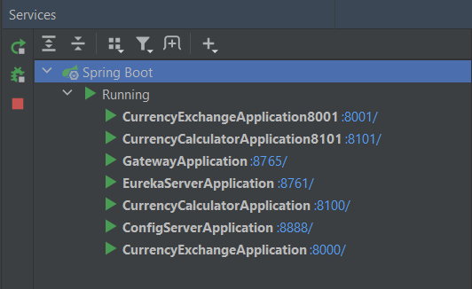
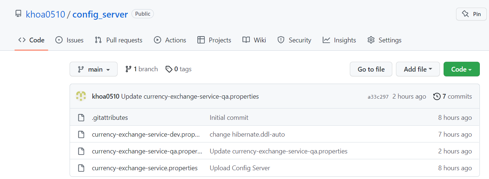
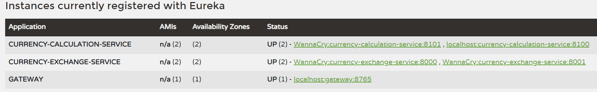
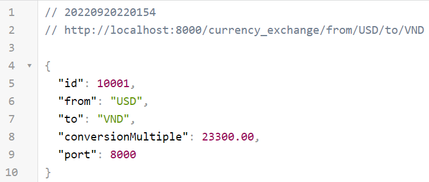
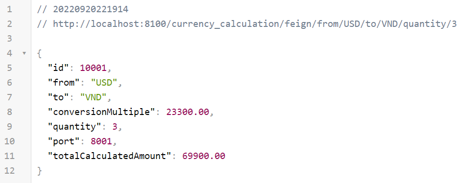
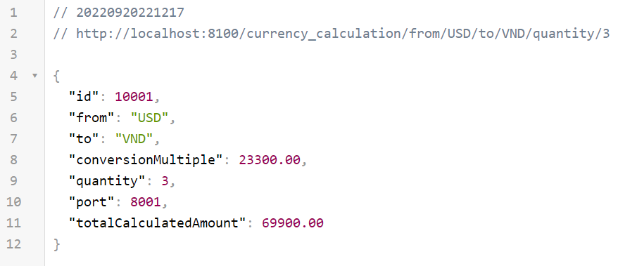
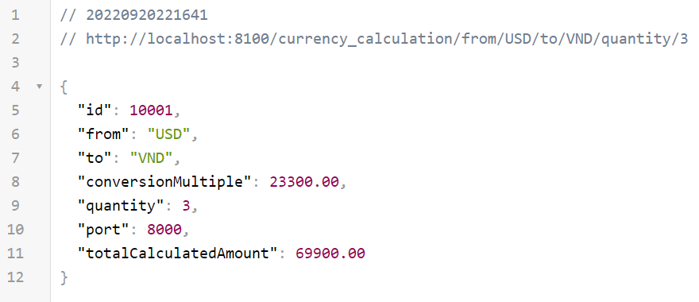

# Currency Exchange Microservices
Simple Currency Exchange Service With Microservice Architecture
1. [Instances in Project](#instances-in-project)
2. [Config Server](#config-server)
3. [Eureka Server](#eureka-server)
4. [Currency Exchange Service](#currency-exchange-service)
5. [Currency Calculation Service](#currency-calculation-service)
6. [Gateway](#gateway)
## Instances in Project

## Config Server
Link Git: ``https://github.com/khoa0510/config_server.git``

### application.yml
```yaml
server:
  port: 8888

spring:
  cloud:
    config:
      server:
        git:
          uri: https://github.com/khoa0510/config_server.git
  ```
### currency-exchange-service-dev.properties:
```properties
spring.h2.console.enabled=true

spring.datasource.url=jdbc:h2:mem:testdb
spring.datasource.driver-class-name=org.h2.Driver
spring.datasource.username=sa
spring.datasource.password=

spring.jpa.show-sql=true
spring.jpa.hibernate.ddl-auto=create-drop
spring.jpa.properties.hibernate.dialect=org.hibernate.dialect.H2Dialect
spring.jpa.defer-datasource-initialization=true
```
### currency-exchange-service-qa.properties:
```properties
spring.h2.console.enabled=true

spring.datasource.url=jdbc:h2:mem:testdb2
spring.datasource.driver-class-name=org.h2.Driver
spring.datasource.username=sa2
spring.datasource.password=

spring.jpa.show-sql=true
spring.jpa.hibernate.ddl-auto=create-drop
spring.jpa.properties.hibernate.dialect=org.hibernate.dialect.H2Dialect
spring.jpa.defer-datasource-initialization=true
```
## Eureka Server
### application.yml
```yaml
server:
  port: 8761
eureka:
  client:
    registerWithEureka: false
    fetchRegistry: false
```
### Eureka with All Instance Running

## Currency Exchange Service
### ExchangeValue entity
```java
@Entity
@Table(name="EXCHANGE_VALUE")
@Getter
@Setter
public class ExchangeValue {
    @Id
    @GeneratedValue
    @Column(name = "id", nullable = false)
    private Long id;

    @Column(name = "currency_from")
    private String from;

    @Column(name = "currency_to")
    private String to;

    @Column(name = "conversion_multiple")
    private BigDecimal conversionMultiple;

    @Column(name = "port")
    private int port;
}
```
### bootstrap.yml
```yaml
spring:
  application:
    name: currency-exchange-service
  profiles:
    active: dev
  cloud:
    config:
      uri: http://localhost:8888
      enabled: true

server:
  port: 8000

eureka:
  client:
    serviceUrl:
      defaultZone: http://localhost:8761/eureka
```
### Get Exchange Value

### Run with port 8001 and include 2 instances to Eureka Server
See Images [Instances in Project](#instances-in-project) and [Eureka Server](#eureka-server)
## Currency Calculation Service
### CalculatedAmount entity
```java
@Getter
@Setter
@AllArgsConstructor
@NoArgsConstructor
public class CalculatedAmount {
    private Long id;
    private String from;
    private String to;
    private BigDecimal conversionMultiple;
    private BigDecimal quantity;
    private BigDecimal TotalCalculatedAmount;
    private int port;
}
```
### FeignClient
```java
@FeignClient(name = "CURRENCY-EXCHANGE-SERVICE")
public interface CurrencyExchangeFeignClient {
    @GetMapping("/currency_exchange/from/{from}/to/{to}")
    CalculatedAmount getExchangeValue(@PathVariable("from") String from, @PathVariable("to") String to);
}
```
### RestTemplate
```java
@Configuration
public class CurrencyCalculationConfig {
    @Bean
    @LoadBalanced
    public RestTemplate restTemplate() {
        return new RestTemplate();
    }
}
```

### Service
```java
@Service
public class CurrencyCalculationServiceImpl implements CurrencyCalculationService {
    @Autowired
    RestTemplate restTemplate;

    @Autowired
    CurrencyExchangeFeignClient currencyExchangeFeignClient;

    public CalculatedAmount getCalculatedAmount(String from, String to, BigDecimal quantity) {
        String url = "http://currency-exchange-service/currency_exchange/from/"+from+"/to/"+to;
        CalculatedAmount calculatedAmount = restTemplate.getForObject(url, CalculatedAmount.class);
        calculatedAmount.setQuantity(quantity);
        calculatedAmount.setTotalCalculatedAmount(calculatedAmount.getConversionMultiple().multiply(quantity));
        return calculatedAmount;
    }

    public CalculatedAmount getCalculatedAmountWithFeign(String from, String to, BigDecimal quantity) {
        CalculatedAmount calculatedAmount = currencyExchangeFeignClient.getExchangeValue(from, to);
        calculatedAmount.setQuantity(quantity);
        calculatedAmount.setTotalCalculatedAmount(calculatedAmount.getConversionMultiple().multiply(quantity));
        return calculatedAmount;
    }
}
```
### Run with Load Balancer Using FeignClient


### Run with Load Balancer Using RestTemplate


### Run with port 8101 and include 2 instances to Eureka Server
See Images [Instances in Project](#instances-in-project) and [Eureka Server](#eureka-server)
## Gateway
### application.yml
```yaml
server:
  port: 8765

eureka:
  client:
    serviceUrl:
      defaultZone: http://localhost:8761/eureka

spring:
  application:
    name: gateway
  cloud:
    gateway:
      routes:
        - id: currencyCalculationService
          uri: lb://currency-calculation-service/
          predicates:
            - Path=/**
```
### Run and include to Eureka Server
See Images [Eureka Server](#eureka-server)